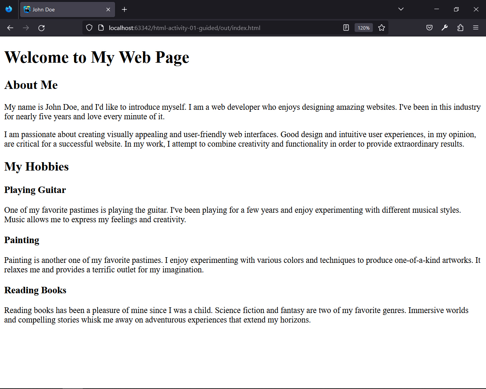
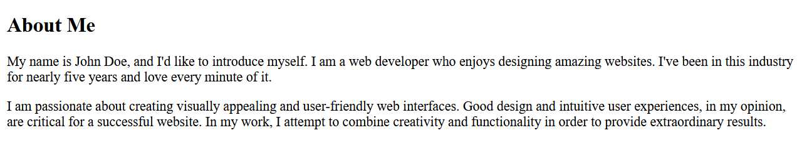
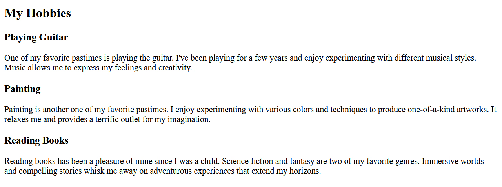

## HTML | Activity #1 (Guided): Headings and Paragraphs
In this activity, we will create a single web page with the following content:




### Development Setup
Create your `index.html` file inside the [**src**](/src) folder in this project.
To test your output, simply open it in your preferred web browser.


### Template and Title
First, we need a regular HTML template that already contains the page `<title>`.
```html
<!DOCTYPE html>
<html lang="en">
<head>
    <meta charset="UTF-8">
    <title>John Doe</title>
</head>
<body>
    
</body>
```


### Primary Heading
Now we will start creating content inside the `<body>` tag.


We will use the `<h1>` tag to create the primary heading.
```html
<body>

    <h1>Welcome to My Web Page</h1>

</body>
```


### Secondary Headings
Right after our primary heading, we can now write our secondary headings.


We will use `<h2>` tags to create these secondary headings.

```html
<body>

    <h1>Welcome to My Web Page</h1>

    <h2>About Me</h2>

    <h2>My Hobbies</h2>

</body>
```


### Content
Now that we've taken care of the primary and secondary headings,
it's time to write content to support our topic.

#### About Me



There are two blocks of text in the **About Me** section,
so we'll use two `<p>` tags for it.

```html
...

    <h2>About Me</h2>
    <p>
        My name is John Doe, and I'd like to introduce myself.
        I am a web developer who enjoys designing amazing websites.
        I've been in this industry for nearly five years and love every minute of it.
    </p>
    <p>
        I am passionate about creating visually appealing and user-friendly web interfaces.
        Good design and intuitive user experiences, in my opinion, are critical for a successful website.
        In my work, I attempt to combine creativity and functionality in order to provide extraordinary results.
    </p>

...
```

#### My Hobbies
The **My Hobbies** section is a bit different.
There are smaller subheaders for each hobby followed by a description.


First, we are going to use `<h3>` tags for these smaller subheaders.

```html
...

    <h2>My Hobbies</h2>

    <h3>Playing Guitar</h3>

    <h3>Painting</h3>

    <h3>Reading Books</h3>

...
```
Then, we will expand the subject of these subheaders using the `<p>` tag.




```html
...

    <h2>My Hobbies</h2>

    <h3>Playing Guitar</h3>
    <p>
        One of my favorite pastimes is playing the guitar.
        I've been playing for a few years and enjoy experimenting with different musical styles.
        Music allows me to express my feelings and creativity.
    </p>

    <h3>Painting</h3>
    <p>
        Painting is another one of my favorite pastimes.
        I enjoy experimenting with various colors and techniques to produce one-of-a-kind artworks.
        It relaxes me and provides a terrific outlet for my imagination.
    </p>

    <h3>Reading Books</h3>
    <p>
        Reading books has been a pleasure of mine since I was a child.
        Science fiction and fantasy are two of my favorite genres.
        Immersive worlds and compelling stories whisk me away on adventurous experiences that extend my horizons.
    </p>

...
```
